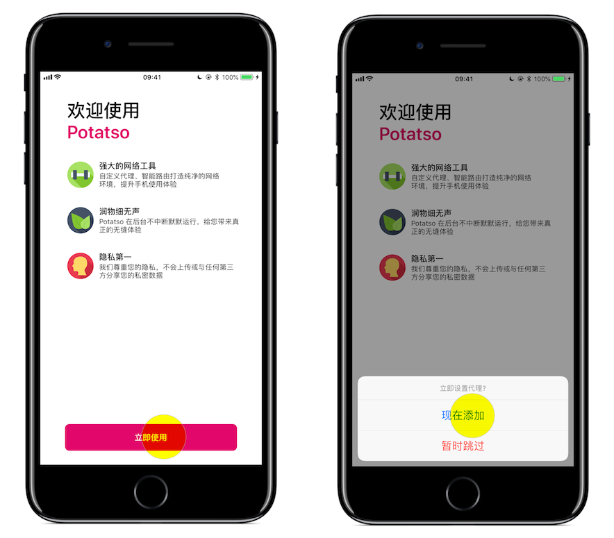
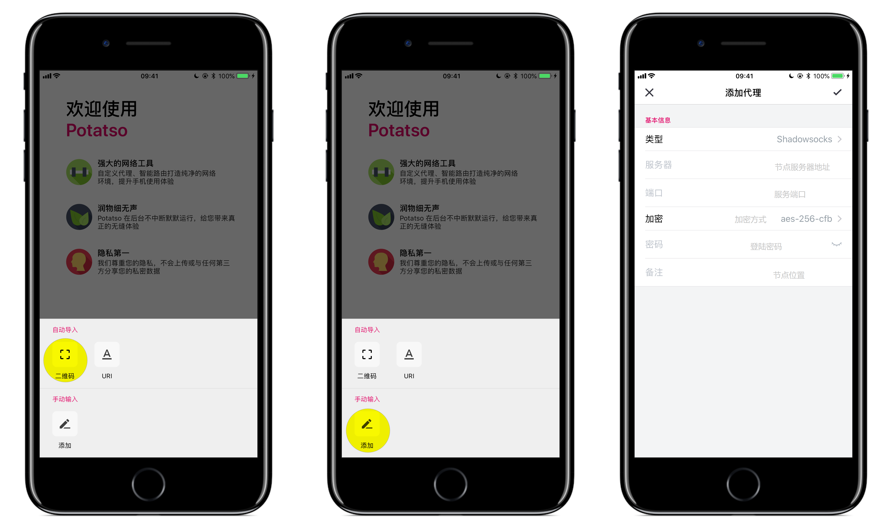
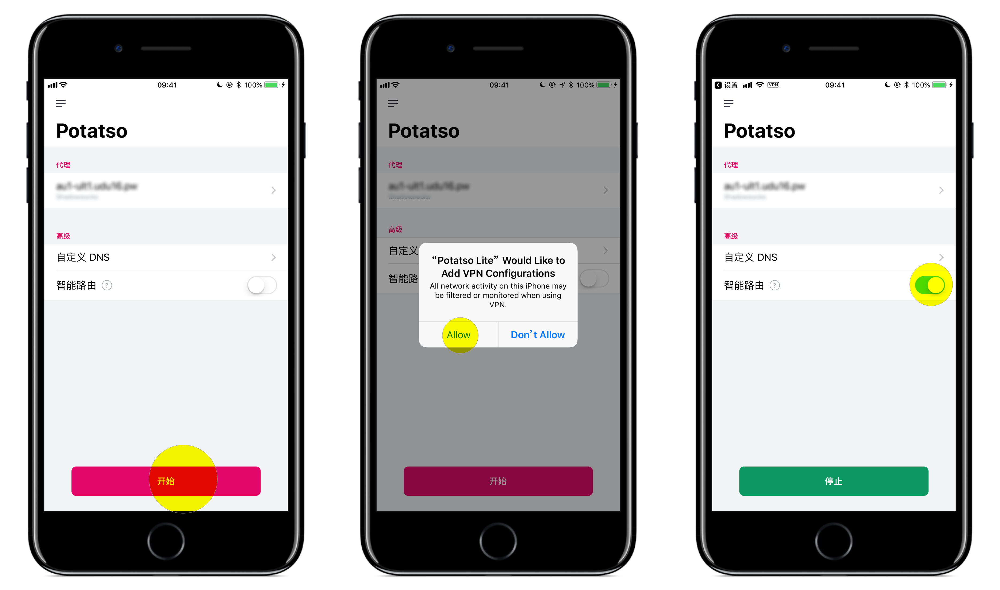

# Shadowsocks 设置方法 (iOS)

## 系统要求
**在安装之前，请始终确保您的系统满足最低系统要求。**

您需要具备 iOS 9.0 或更高版本才能运行 `Shadowrocket` 。 如果您的 iOS 系统版本较旧， 则请先升级到 iOS 9.0 或更高版本

您需要具备 iOS 10.0 或更高版本才能运行 `Potatso Lite` 。 如果您的 iOS 系统版本较旧， 则请先升级到 iOS 10.0 或更高版本。

## Apps 下载

请使用**非中国内地区**的 Apple ID 搜索并购买应用，本站并不提供Apple ID，也不提供破解版的 App。

* [Potatso Lite](https://itunes.apple.com/us/app/potatso-lite/id1239860606?mt=8) （免费）
* [Shadowrocket](https://itunes.apple.com/us/app/shadowrocket/id932747118?mt=8) （收费）
* [Potatso 2](https://itunes.apple.com/us/app/potatso-2/id1162704202?mt=8)（收费）

**App Store 上的 App 由其作者进行维护，并非由我们开发，如有疑问，请联系其作者。**

## Shadowsocks 配置 - Potatso Lite

#### 登陆SS网站, 执行下列操作：

* 单击 “服务” > "我的服务" > 选择 "你可用的产品/服务"。
* 查看你的节点信息。

> 以上操作可能不相同，主要就是从分享节点的网站中获取节点配置信息。

#### Potatso Lite 的设置过程：

* 从 App Store 安装后打开 Potatso Lite。
* 点击 "立即使用" > "现在添加"。

**扫码配置**

* 点击 "二维码" > "Potatso Lite 想访问您的相机"的窗口，选择 "好" > 扫描你节点的二维码，节点将自动添加成功。

**手动配置**

* 点击 "添加" > 填写代理。
* 选择 "Shadowsocks“ > 填写 "服务器" > 填写 "端口" > 选择 "加密" > 填写 "密码" 。
* 填写 "备注" 为可选项 > 点击右上角的 "✔"， 设置完成。

**开始代理**

* 点击 "开始" > 选择 "Allow" > 开启 "智能路由"。
* 当看到左上角出现 VPN 字样时，代表连接成功。
* **智能路由** 表示可以实现自动代理， 及本来可以访问的网站不会经过代理，推荐日常使用。

## Shadowsocks 配置 - Shadowrocket

下载安装后打开 Shadowsocks

点击 `Add Server` 即可添加您的节点信息

**扫码配置**
点击左上方图标(绿色)即可扫码配置

**手动配置**
点击右上方 + (橙色)后按照提示配置

在您完成配置后请到 Shadowrocket 的 Home 界面点击第一个滑块以开启 (紫色区域)

如需要关闭 Shadowsocks，打开 Shadowrocket 的 Home 点击滑块即可关闭
