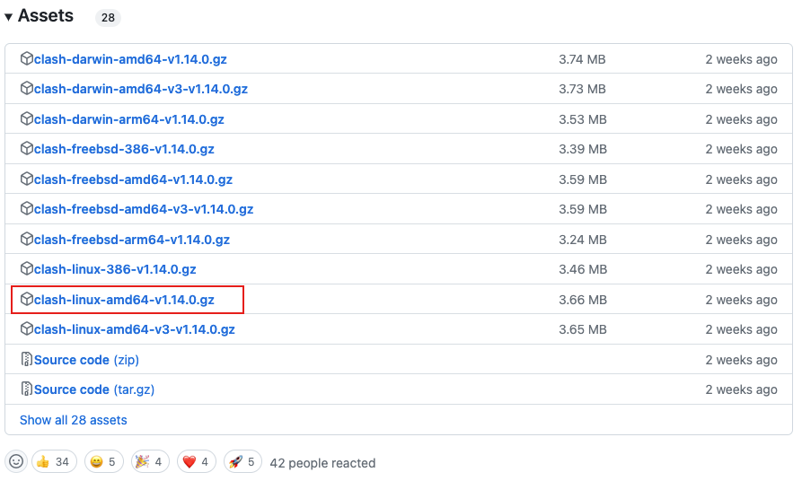
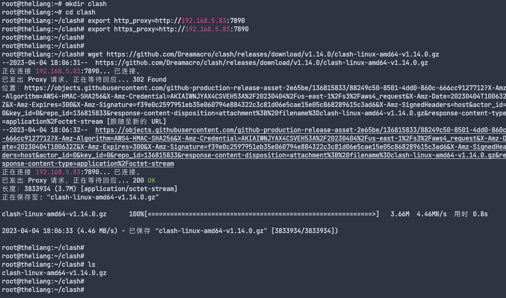
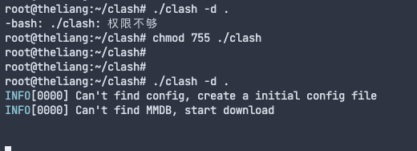
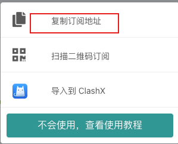
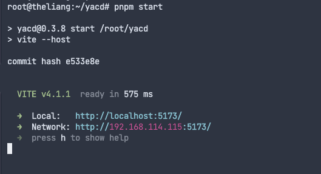
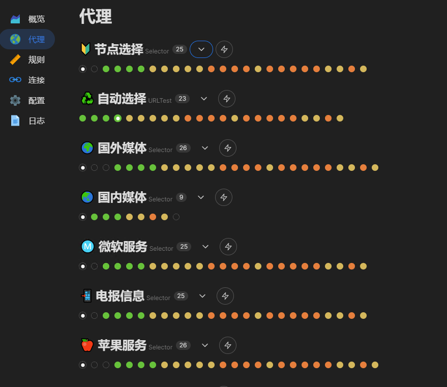
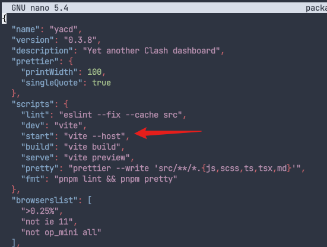

### Linux(Centos7) 使用Clash For Linux网络代理工具教程

> 注意该教程为Clash客户端

1. 下载客户端：[clash地址](https://github.com/Dreamacro/clash/releases) , 选择对应系统的下载，这里我选的如图所示



下图是直接在Linux中下载的截图




2. 解压文件，使用命令 `gzip -d clash-linux-amd64-vX.XX.XX.gz`
3. 重命名：`mv clash-linux-amd64-v1.14.0 clash`
4. 给Clash授权 ： `chmod 755 ./clash`
5. 初始化Clash

执行  `./clash -d .`  即可启动 Clash，同时会自动下载 `Country.mmdb` 文件

如果是执行 `./clash` 则会到 `~/.config/clash` 下读取 `config.yaml` 和 `Country.mmdb` 文件



> 这里可能需要设置一下代理才可以将 Country.mmdb 文件下载下来，你可以从其他地方下载后拷贝到服务器，或者需要你有科学上网条件，可以执行下面命令
>
> export http_proxy=http://192.168.1.7:7890
>
> export https_proxy=http://192.168.1.7:7890

这个时候目录下就会有对应文件：`cache.db  clash  config.yaml  Country.mmdb`

6. 下载配置文件替换为 `config.yaml` , 这个配置为你购买的服务的订阅配置



7. 启动：`./clash -d .`  执行即可

> 如果需要后台执行的话，可以使用命令：`nohup ./clash -d . &`
>
> 如果需要使用pm2托管的话，可以使用命令：`pm2 start "./clash -d ." --name=clash`


至此，Clash客户端安装完成


### 安装Docker版Clash


1. 下载Clash的Docker镜像：`docker run -d --name=clash -v "$PWD/clash:/root/.config/clash/" -p "7890:7890" -p "7891:7891" -p "9090:9090" --restart=unless-stopped dreamacro/clash`

2. 上面步骤完成后，就会在当前目录下生成clash文件夹，打开文件夹，将文件夹下的`config.yaml` 替换成上面我们从机场购买的配置
3. 修改后直接生效，这里安装完成了


### 安装Clash-UI


> 用于在浏览器中查看节点信息。

这个步骤可以省略，可用的这个网站的：http://clash.razord.top/。当然如果有需求可以自己去搭建一下


1. 下载源码：[地址](https://github.com/haishanh/yacd.git)
2. 安装：`pnpm i`
3. 启动：`pnpm start` ，打包到nginx启动：`pnpm build`



4. 打开：http://localhost:5773 即可完成



> 如果需要其他局域网访问的话，需要在 `package.json` 文件中增加 `--host` 的配置



### 安装Docker版Clash-UI


命令：`docker run -p 1234:80 -d --rm --name yacd haishanh/yacd`

1. 打开网站后，输入服务器的IP，端口（UI监听端口），密钥(对应的secret)
2. 其它服务器配置代理


### 自动更新订阅配置文件

TODO


### 常见问题


#### 1. 订阅不成功

可能是订阅的链接是一个加密的，需要通过base64解密，这里可以使用第三方的订阅转化链接，如：https://acl4ssr.netlify.app/ 。需要注意的是，他们仍然需要科学上网。

#### 2. 配置文件内容是啥

```yaml
# HTTP 代理端口
port: 7890 

# SOCKS5 代理端口
socks-port: 7891 

# Linux 和 macOS 的 redir 代理端口
redir-port: 7892 

# 允许局域网的连接
allow-lan: true

# 规则模式：Rule（规则） / Global（全局代理）/ Direct（全局直连）
mode: Rule

# 设置日志输出级别 (默认级别：silent，即不输出任何内容，以避免因日志内容过大而导致程序内存溢出）。
# 5 个级别：silent / info / warning / error / debug。级别越高日志输出量越大，越倾向于调试，若需要请自行开启。
log-level: silent
# Clash 的 RESTful API
external-controller: '0.0.0.0:9090'

# 测试延迟的网站
cfw-latency-url: 'www.google.com'

# RESTful API 的口令
secret: '' 

# 您可以将静态网页资源（如 clash-dashboard）放置在一个目录中，clash 将会服务于 `RESTful API/ui`
# 参数应填写配置目录的相对路径或绝对路径。
# external-ui: folder


proxies:
  - *****
  - *****
```


