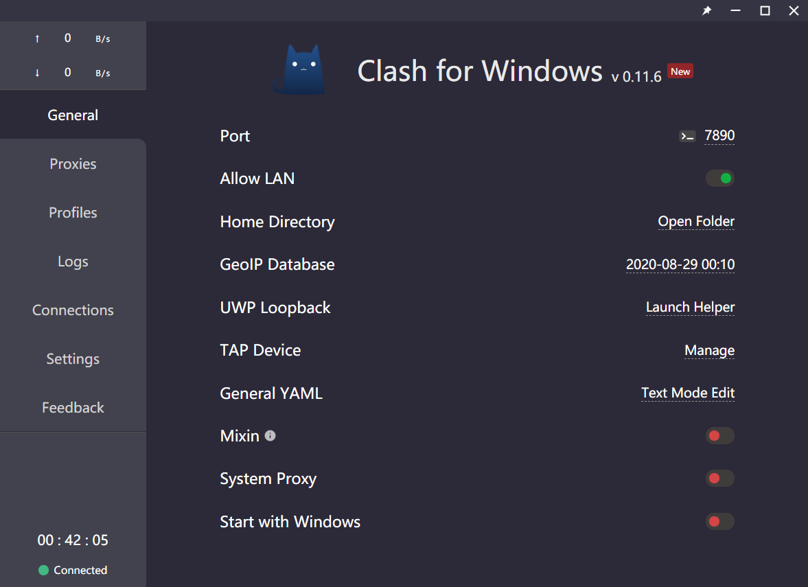
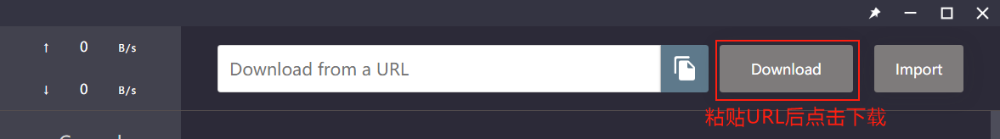

简介
--

Clash for Windows 可能是Windows 上最好用的代理工具。

下载及安装
-----

[Clash下载](https://github.com/Fndroid/clash_for_windows_pkg/releases)

1.  下载完成后，打开Clash 安装程序，使用默认设置安装。
2.  安装成功后会自动运行Clash ，屏幕底部任务栏将显示Clash 图标（猫咪）。
    *   如果您看不到Clash图标，它可能已隐藏，点击可显示隐藏的图标。
    *   双击任务栏Clash 图标可显示软件主界面。
3.  右键点击桌面上的Clash for Windows图标>属性>兼容性> 选中「以管理员身份运行此程序」>确定。

#### 注意

为了确保Clash 正常运行，在安装和运行过程中有任何警告窗口都不要阻止。

设置
--

*   **获取订阅地址**  
    1.  购买相关服务套餐后获取配置文件。
    2.  如已购买，前往用户后台，登入后即可进入您的管理产品页面。
    3.  在管理产品页面上，依次点击「Windows」>「Clash」>「复制订阅地址」。
    
*   **导入订阅地址**
    
    1.  打开Clash for Windows 应用程序。
    2.  前往配置管理「Profiles」界面，同时按下「 Ctrl + V 」粘贴刚刚复制的「配置文件地址」，然后轻点「Download」，成功下载后会在下方显示配置文件卡片，轻点「配置文件卡片」以选中，当前使用的配置文件将以黑色显示。
    
    

使用
--

*   前往代理「Proxies」界面，轻点「眼睛」图标可以显示或隐藏节点，轻点「节点名称」可切换节点。轻点「闪电」图标可测试节点状态，连续测试三次以上才能反映出节点是否正常，但无法测试节点速度。顶部的三个按钮可控制流量的出站模式，Global 指代理所有地址，Rule 指通过配置文件里的规则自动分流，Direct 指所有地址都不走代理。

*   前往常规「General」界面，打开「System Proxy」，就能连接到全球互联网了。 

#### 使用小贴士

Clash 每次启动时会自动尝试更新节点& 规则，同时您也可以手动来立即更新节点信息。