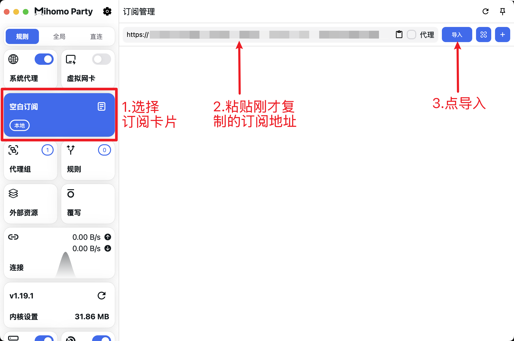
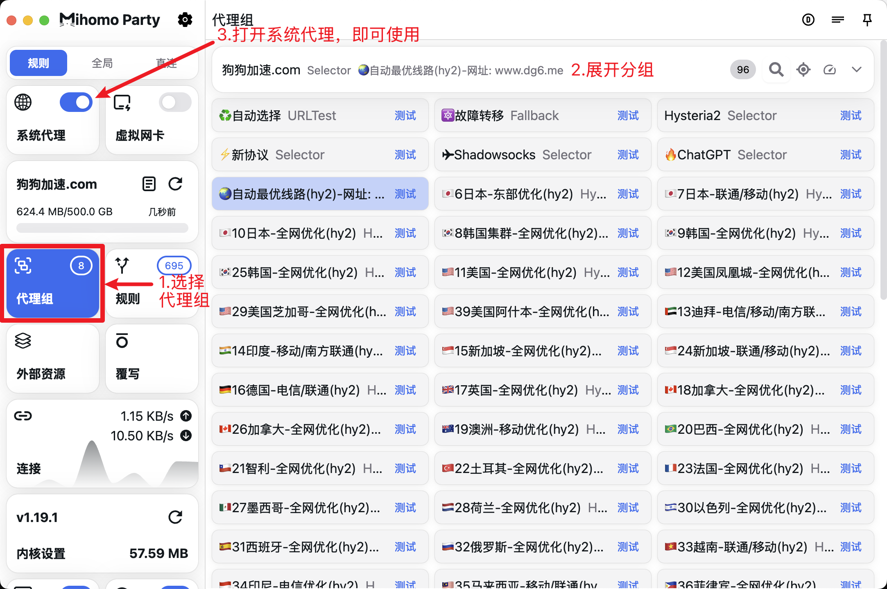
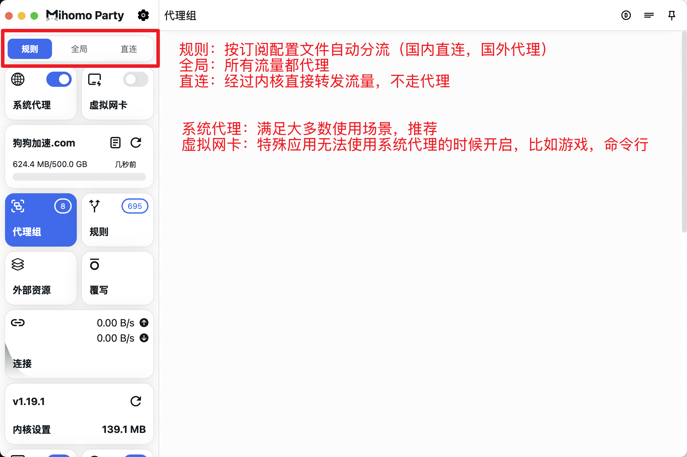

# Clash Party Windows 使用教程

Clash Party 是基于 Mihomo 内核的图形客户端，适合 Windows 用户导入订阅并管理代理节点。本教程以常见订阅链接为例说明基础使用流程。

> Clash for Windows 已停止维护，不建议新用户继续使用。本教程不再适用于 Clash for Windows。

## 1. 下载与安装

1. 前往 [Clash Party 官方下载页](https://github.com/mihomo-party-org/clash-party/releases/latest)。
2. 大多数 Windows 电脑请选择名称中包含 `windows`、`x64` 和 `setup.exe` 的安装包；如果需要免安装使用，可选择 `portable.7z` 压缩包并解压。
3. 双击安装包并按提示完成安装；便携版解压后，直接运行目录中的程序即可。
4. 首次启动后，允许应用通过 Windows 防火墙的提示（如有）。

> 请只从官方 GitHub Release 或可信软件源下载客户端，不要安装来历不明的“破解版”或捆绑安装包。

## 2. 导入订阅

1. 在机场或服务商后台复制 **Clash / Mihomo 订阅地址**。
2. 打开 Clash Party，在左侧选择空白订阅卡片；如没有空白卡片，可先新建订阅。
3. 将订阅地址粘贴到页面顶部的输入框，点击右侧的「导入」。
4. 导入完成后，订阅卡片会显示流量、到期时间或更新时间等信息（具体内容取决于服务商）。

## 3. 选择节点并开启代理

1. 在左侧点击「代理组」。
2. 展开需要选择的代理组，在列表中选择节点；通常可先选择「自动选择」或延迟较低的节点。
3. 打开左侧的「系统代理」开关。开启后，大部分遵循系统代理设置的浏览器和应用即可使用代理。

## 4. 选择代理模式

界面顶部可切换三种模式：

- **规则**：按订阅配置中的规则分流；通常推荐日常使用。
- **全局**：所有流量都通过所选代理节点。
- **直连**：所有流量直接连接，不使用代理。

一般情况下，保持「规则」模式并开启「系统代理」即可。

## 5. 更新订阅与常见问题

- **更新订阅**：在左侧订阅卡片上点击刷新图标，获取最新节点和规则。
- **网页无法连接**：确认已选择节点并开启「系统代理」；随后尝试更新订阅或更换节点。
- **个别应用不走代理**：可尝试开启「虚拟网卡（TUN）」；该模式会接管更多系统流量，首次使用请按 Clash Party 的提示完成授权。若不清楚其作用，先使用「系统代理」即可。
- **订阅导入失败**：确认复制的是完整订阅地址，而非单个节点链接或服务商后台页面地址；必要时在服务商后台重新生成订阅链接。

## 参考

- [Clash Party 官方网站与使用指南](https://mihomo.party/docs/handson)
- [Clash Party 官方 GitHub 仓库](https://github.com/mihomo-party-org/clash-party)
