# Shadowsocks 配合 Proxifier 实现客户端代理


- [什么是 Proxifier](#什么是-proxifier)
- [使用方法](#使用方法)
    - [Proxifier 下载](#proxifier-下载)
        - [Windows 版本](#windows-版本)
        - [macOS 版本](#macos-版本)
    - [详细使用方法](#详细使用方法)
        - [Windows使用](#windows使用)
        - [MacOS 使用](#macos-使用)


## 什么是 Proxifier

Proxifier 是一款功能非常强大的 socks5 客户端，可以让不支持通过代理服务器工作的网络程序能通过 HTTPS 或 SOCKS 代理或代理链。支持64位系统，支持 XP，Vista，Win7，macOS, 支持 socks4，socks5，http 代理协议，支持 TCP，UDP 协议，可以指定端口，指定 IP，指定域名,指定程序等运行模式，兼容性非常好，和 SOCKSCAP 属于同类软件，不过 SOCKSCAP 已经很久没更新了，不支持64位系统。有许多网络应用程序不支持通过代理服务器工作，Proxifier 解决了这些问题和所有限制，让您有机会不受任何限制使用你喜爱的软件。此外，它让你获得了额外的网络安全控制，创建代理隧道，并添加使用更多网络功能的权力。

## 使用方法

### Proxifier 下载

官网下载地址：[点击这里](http://www.proxifier.com/download.htm)

#### Windows 版本

软件分为 Standard Edition 和 Portable Edition 版本，可在“工具下载”中找到对应工具

#### macOS 版本

请自行购买注册码

若系统为 10.11，请下载[Beta版 ](https://www.proxifier.com/distr/ProxifierMacBeta.zip)

若 Yosemite 下 Proxifier 不能运行，打开 终端 应用，运行下面的命令然后重启

```
sudo nvram boot-args="kext-dev-mode=1"
```

### 详细使用方法


#### Windows使用

下面以将应用 Onedrive 经过 SS代理做示例

1. 确保小飞机内的局域网共享已经打开！注意代理端口处为1080【默认】）


2. 点击配置代理服务器设置，点击添加
   服务器里面按照图填写，127.0.0.1 1080 socks5

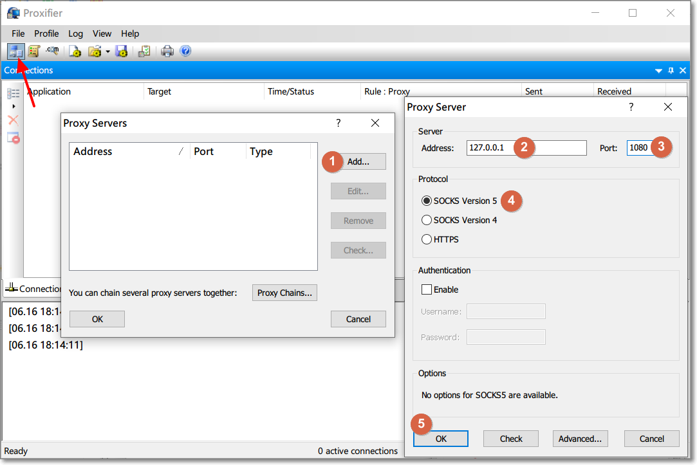


3. 确定后弹出来的界面，这里点击“否”

> 翻译：
> 您是否要让Proxifier 在默认情况下使用此代理服务器？
> 您可以在 "配置文件->代理规则"中更改此选项

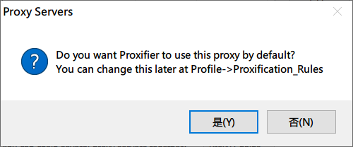


4. 再次点击确认后，会弹出来的配置代理规则界面，这里可以点击“是”

> 翻译：
> 您没有在"配置文件->代理规则"中启用任何代理服务器。
> 您是否要立即编辑"代理规则"？

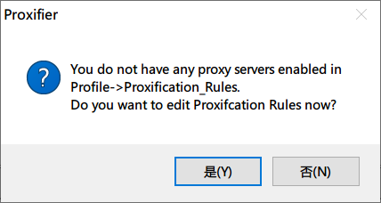

如果点击“否”了也没关系，可以在编辑代理规则中继续设置
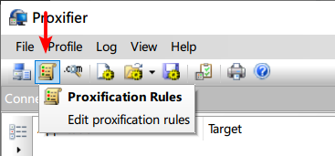


5. 可以看到下图，默认有两条规则，建议不要对这两条做编辑
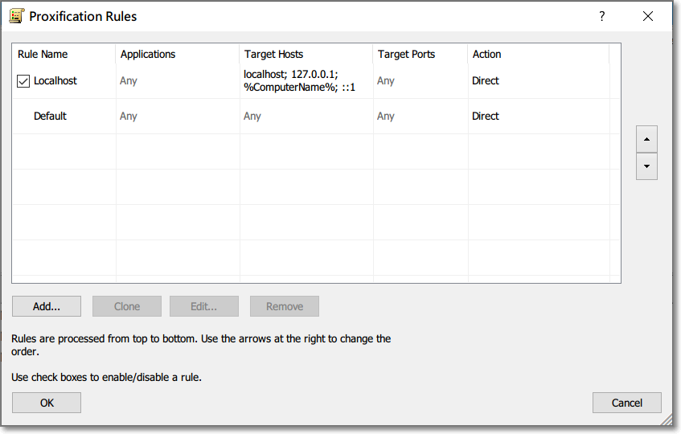

6. 点击添加，名字随意设置，应用程序里面就填写需要代理的程序的exe文件，动作那里选择代理Proxy
    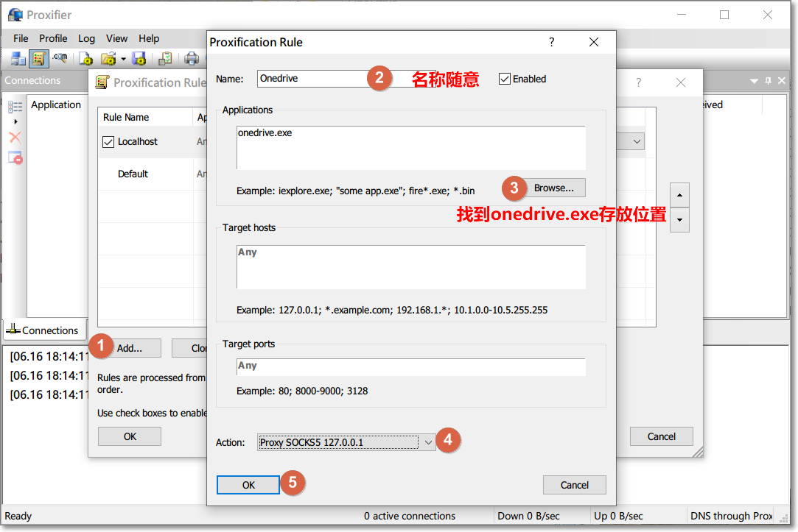

7. 添加完成后，点击确认

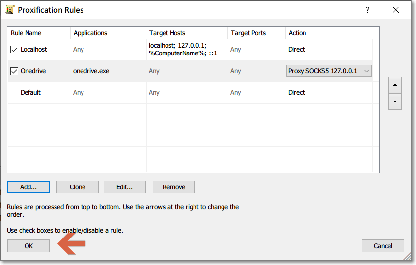

8. 可以看到该应用程序已经按照设置的方式进行代理

  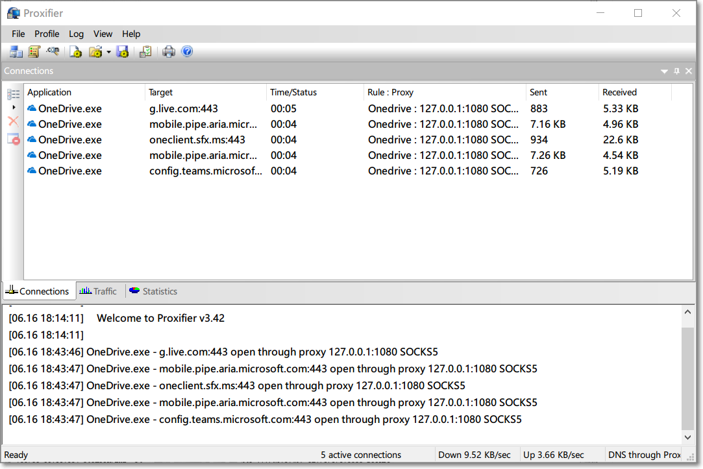

#### MacOS 使用

首先点击 `proxies` > `add`

在其中填写 `socks5` 的代理地址 `127.0.0.1:1080` 请确保与图中一致

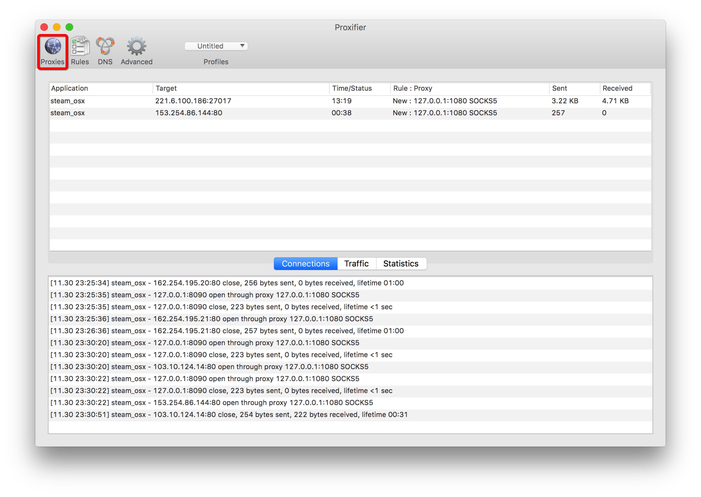
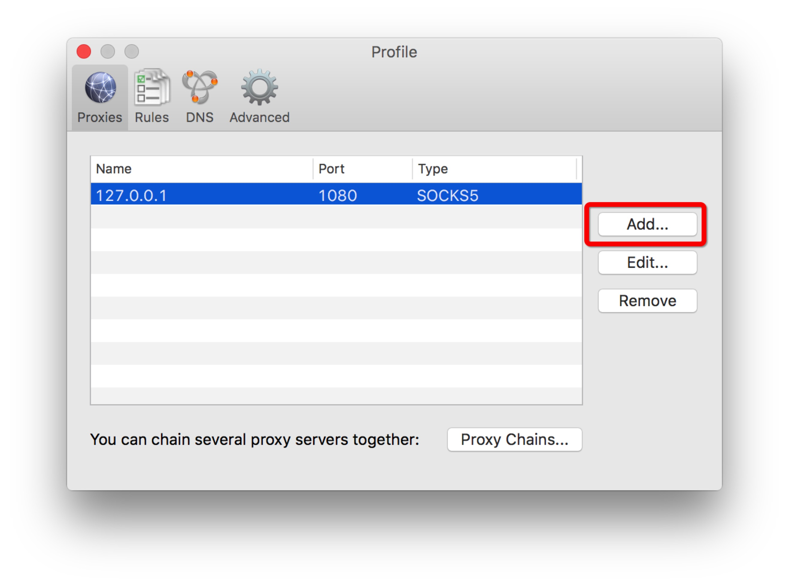

接下来填写代理规则

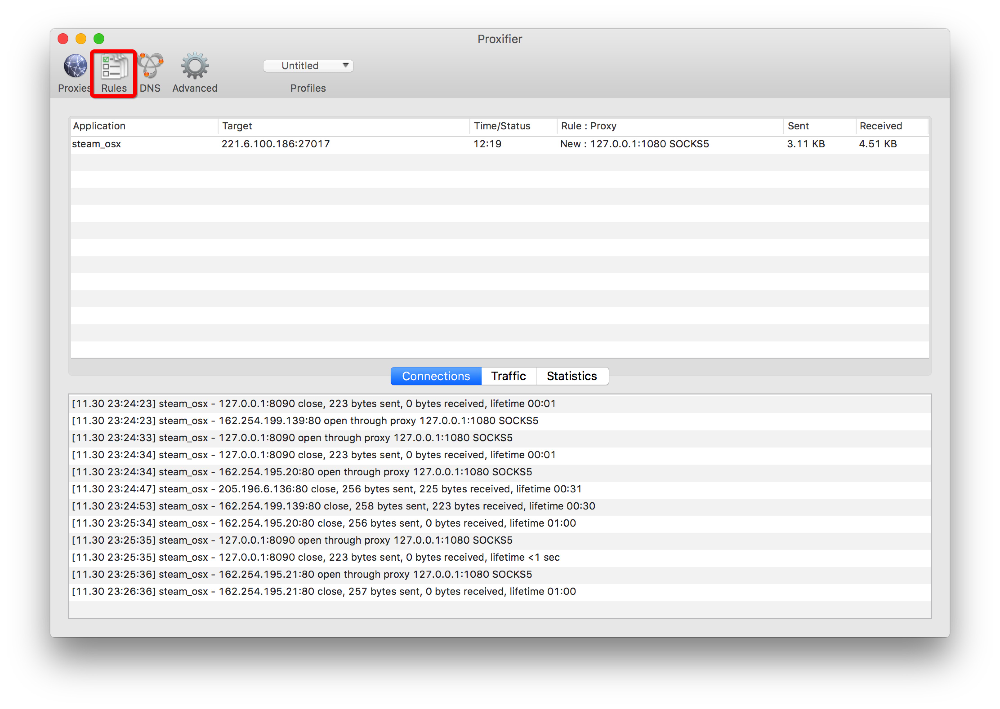

中最重要的就是请将 Shadowsocks 客户端设置为全局模式

如图，点击*+* 添加 APP，再在 `Action` 中选择 `Direct`

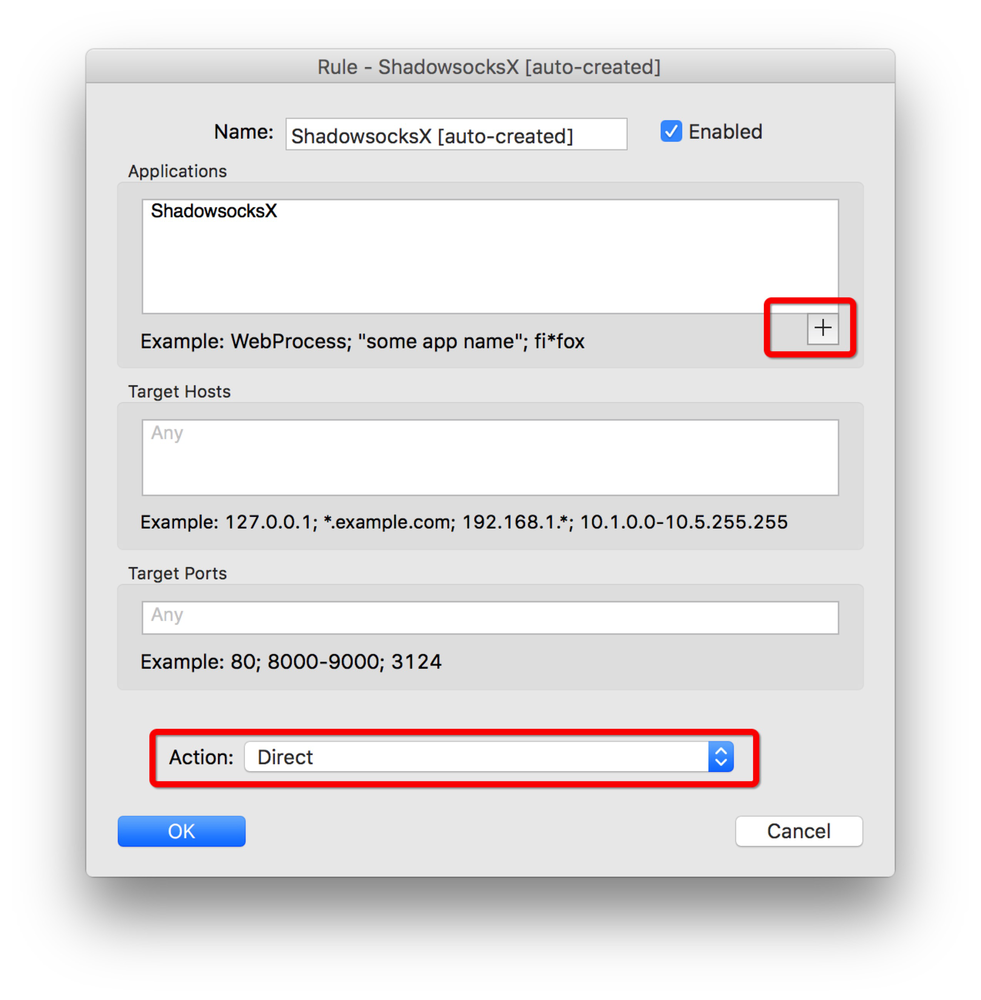

此时就可以添加其他 APP 了，比如让 Steam 和 CS:GO 走 Shadowsocks 以降低延迟，那么如图：

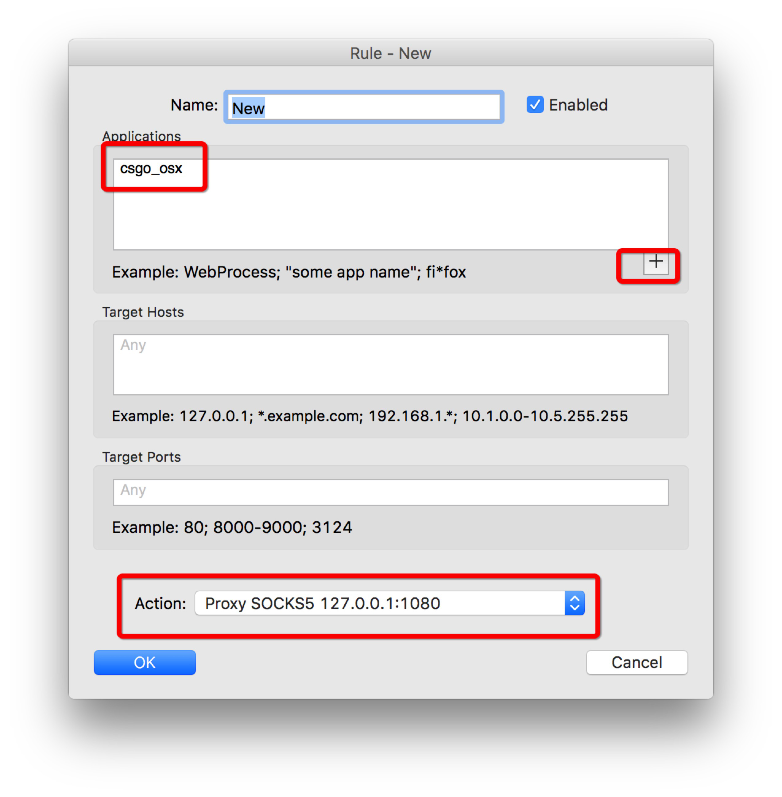

确保选择的是走 `socks5` 就可以了

