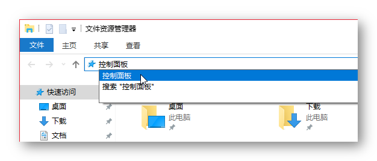
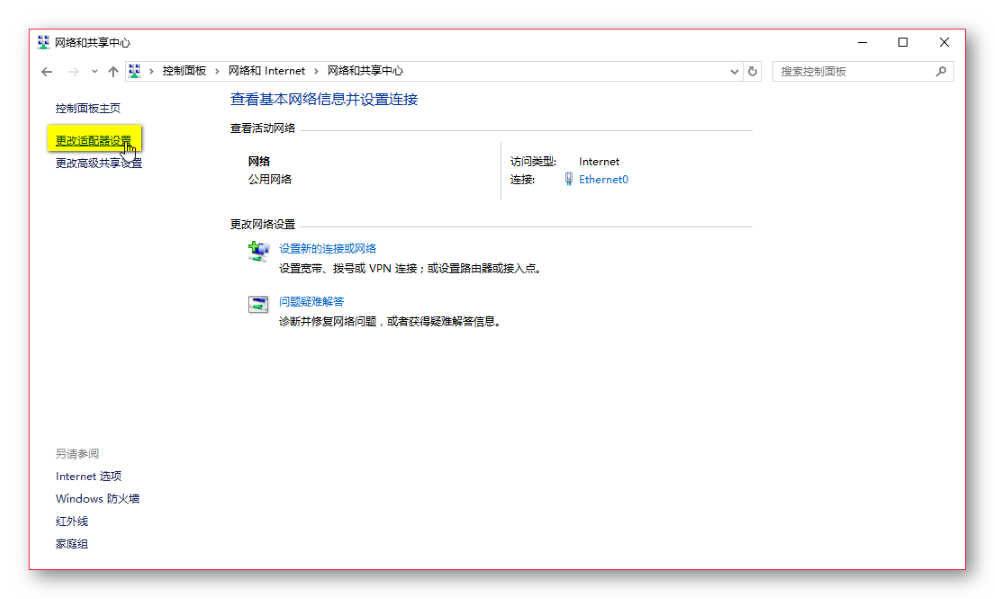
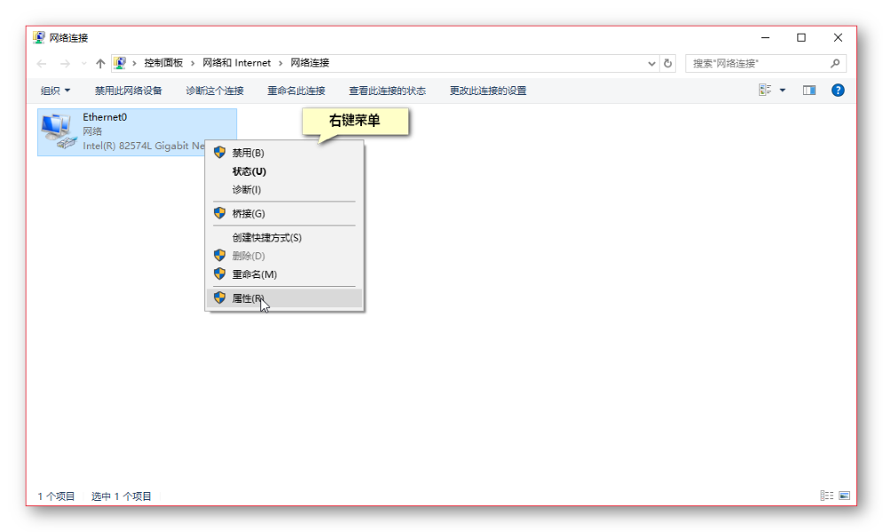
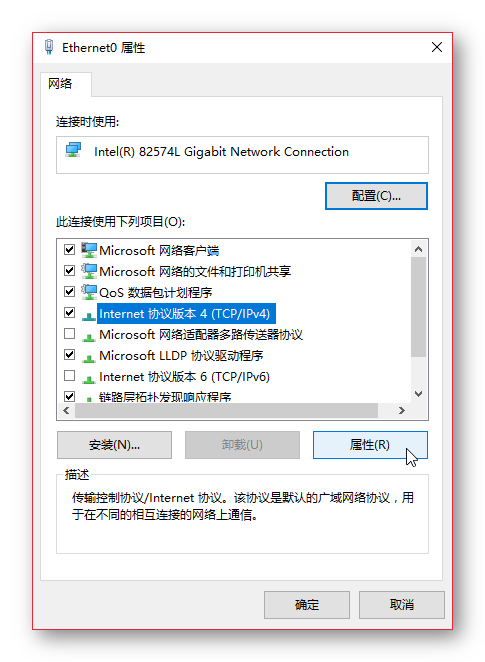
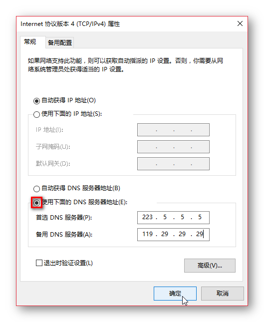
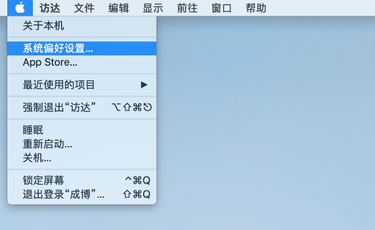
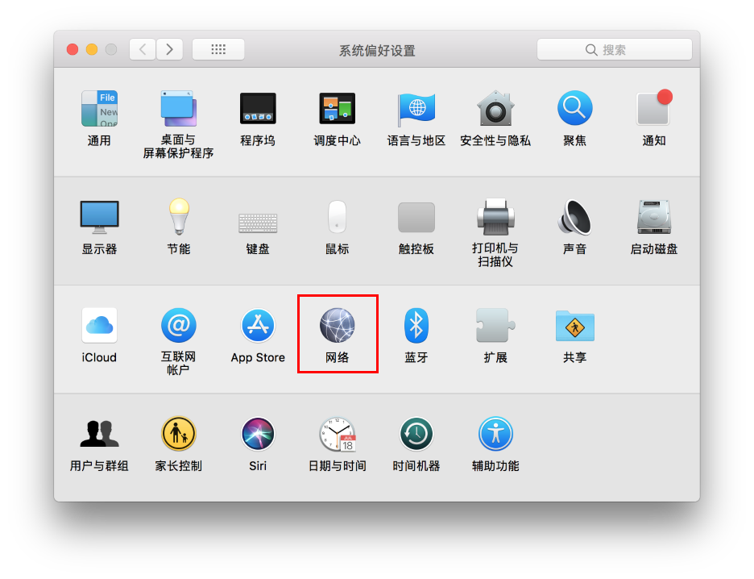
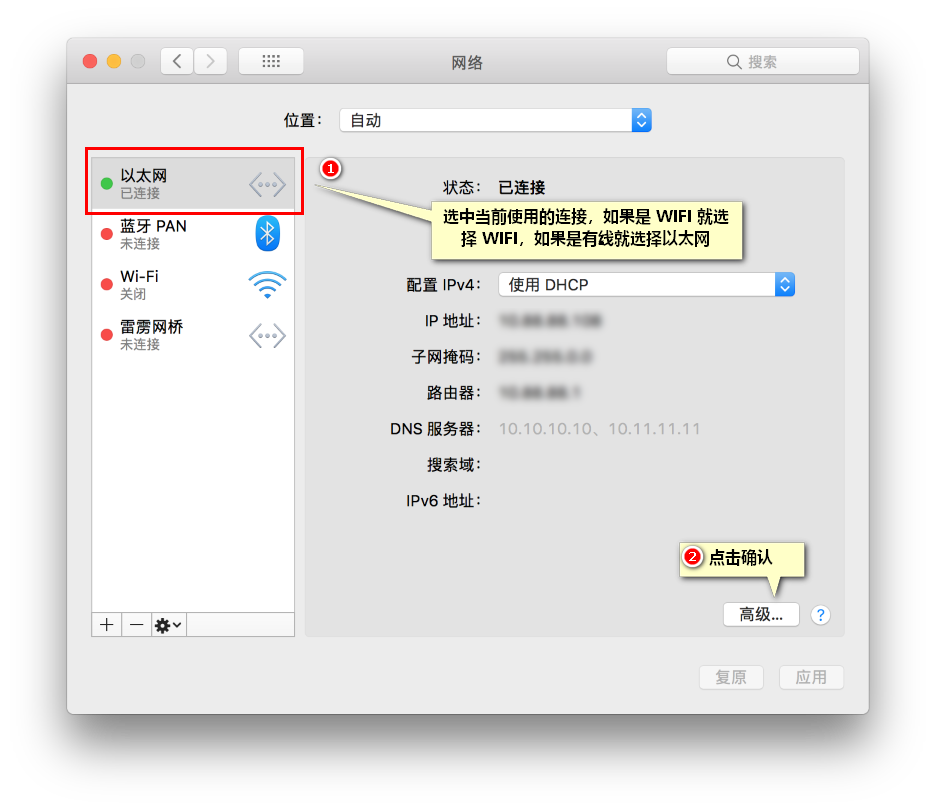
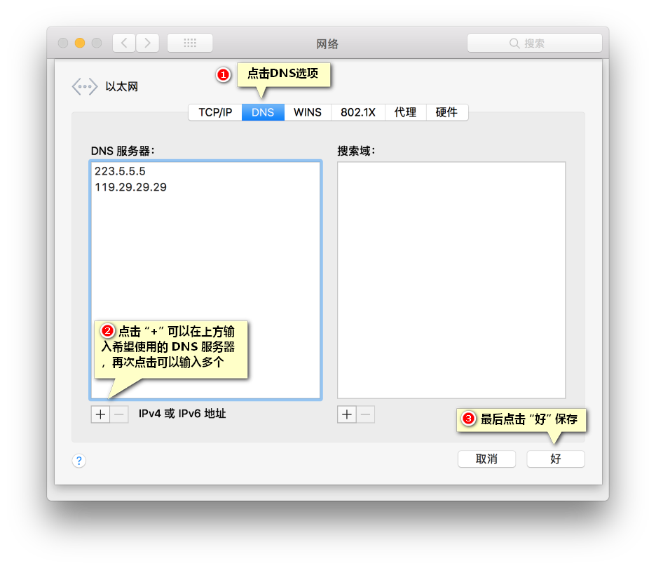
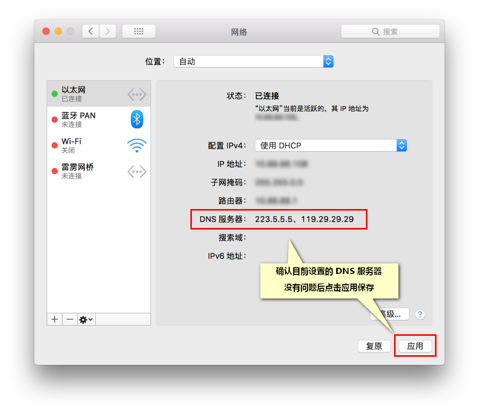

# 自定义设置 DNS 服务器

- [常用第公共 DNS 提供商](#常用第公共-dns-提供商)
- [设置方法 - Windows 7/8/10](#Windows 7/8/10)
- [设置方法 - Windows XP](#windows-xp)
- [设置方法 - macOS](#macos)

## 常用第公共 DNS 提供商
一般来说使用国内的 DNS 即可，使用国外 DNS 可能导致网页访问缓慢的情况发生。

### 国内
- [阿里](http://www.alidns.com/): 223.5.5.5 / 223.6.6.6
- [114](https://www.114dns.com/): 114.114.114.114 / 114.114.115.115
- [DNSpod DNS+](https://www.dnspod.cn/Products/Public.DNS): 119.29.29.29  

### 国外
- [Google](https://developers.google.com/speed/public-dns/docs/using)： 8.8.8.8 / 8.8.4.4
- [CloudFlare](https://1.1.1.1/): 1.1.1.1
- [Quad9](https://www.quad9.net/): 9.9.9.9
- [OpenDNS](https://www.opendns.com/): 208.67.222.222 / 208.67.220.220

## Windows 7/8/10
1. 打开控制面板
按 `Windows + E` 打开资源管理器，在地址栏中输入 `控制面板` 后回车，打开控制面板。

2. 在控制面板界面点击 `查看网络状态和任务`，打开网络和共享中心  
  

3. 在网络网络和共享中心界面点击左上角 `更改适配器设置`，打开网络连接界面  

4. 在网络连接界面，选中正在使用的连接 > 点击右键 > 点击属性

5. 在网络连接属性窗口中选中 `Internet 协议版本 4 (TCP/IPv4)` 然后点击“属性”。  

6. 在设置界面，首先选中 `使用下面的 DNS 服务器地址(E)` ，随后在下方输入要使用的 DNS 服务器，最后点击确定设置完成。  

## Windows XP  
1. 从开始菜单中选择控制面板。  
2. 从控制面板选项中单击网络连接。  
3. 从网络连接窗口中选择您的连接。如果你有不止一个连接，选择你的默认/当前连接。  
4. 右键点击属性  
5. 选择internet协议（TCP/IP）然后单击属性。    
6. 单击“使用下面的DNS服务器地址”， 在首选DNS服务器和备选DNS服务器中输入要使用的 DNS 服务器。  

## macOS
1. 选取苹果菜单 >“系统偏好设置”    

2. 找到网络图标，点击进入  

3. 从列表中选择想要使用的网络连接服务（例如 WIFI 或以太网），然后点按“高级”  

4. 找到DNS的标签，然后点击左下角“+”，填写希望使用的 DNS 服务器，之后点击"好"  

5. 返回到上一级，确认设置，并点击“应用”  

