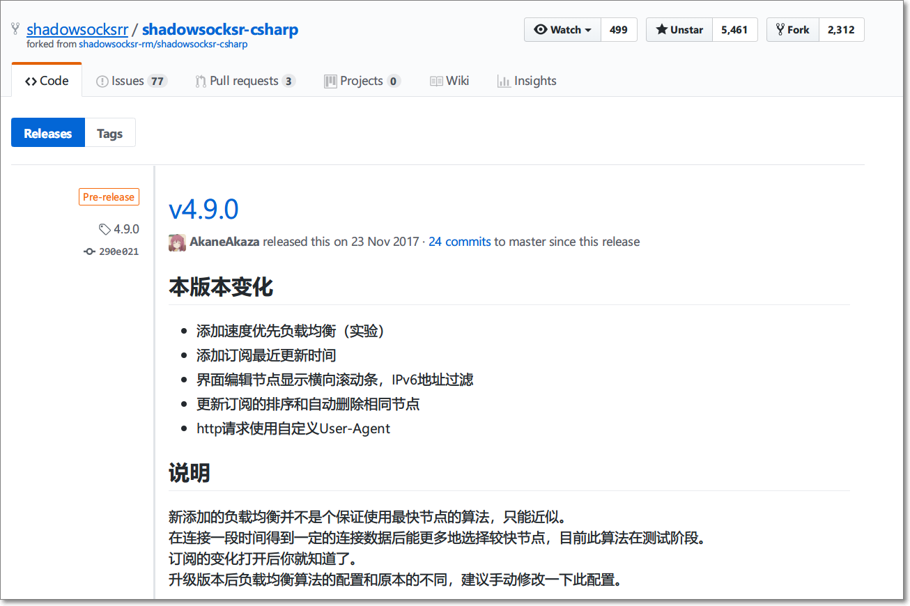
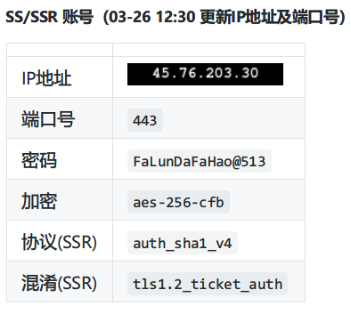

# ShadowsocksR 设置方法 (Windows)

- [系统要求](#系统要求)
- [安装 ShadowsocksR](#安装-shadowsocksr)
	- [1. 下载客户端](#1-下载客户端)
	- [2. 解压客户端](#2-解压客户端)
- [配置 SSR 账号](#配置-ssr-账号)
	- [二维码方式添加节点](#二维码方式添加节点)
	- [导入 SSR:// 链接](#导入-ssr-链接)
	- [手动配置账号](#手动配置账号)

>  ShadowsocksR 即 SSR，以下将使用简写

## 系统要求

**在安装之前，请始终确保您的系统满足最低系统要求。**

您需要具备 Windows 7 SP1 或更高版本才能运行 Shadowsocks。如果您的操作系统版本较旧， 则请先升级到  Windows 7 SP1 或更高版本。

**NET Framework**: 如果你的计算机未安装.NET Framework, 请点击 [这里](https://www.microsoft.com/zh-tw/download/details.aspx?id=53345) 下载最新版本的 .NET Framework。

## 安装 ShadowsocksR

按照下面的说明在 Windows 中下载并安装 ShadowsocksR。

#### 1. 下载客户端

访问 ShadowsocksR Windows 客户端 [下载页面](https://github.com/shadowsocksrr/shadowsocksr-csharp/releases)。
下载最新版本的 `ShadowsocksR-win-x.x.x.zip`  (`x.x.x`为版本号) 。

#### 2. 解压客户端

右键 `ShadowsocksR-win-4.9.0.zip` 压缩文件 > "全部解压缩"。
点击 "浏览" 选择想要解压到的文件目录 > "完成时显示提取的文件" > "提取"。
双击运行 `ShadowsocksR-dotnet4.0.exe`。

## 配置 SSR 账号

> 以下三种方法，任选其一

#### 二维码方式添加节点

**在分享节点的网站中一般都有查看二维码的功能。**

- 右键状态栏  > "二维码扫描..."。
- 点击 "系统代理模式" > "PAC 模式" 。

#### 导入 SSR:// 链接

从分享节点的网站中获取到以 SSR:// 为前缀的链接

- 先拷贝SSR://链接
- 右键状态栏  > "剪贴板批量导入SSR://链接..."。

#### 手动配置账号

> 如果以上的功能都不存在的话，那么你可以选择此种方式来添加账号

从分享节点的网站中依次填入相应信息，确定即可

