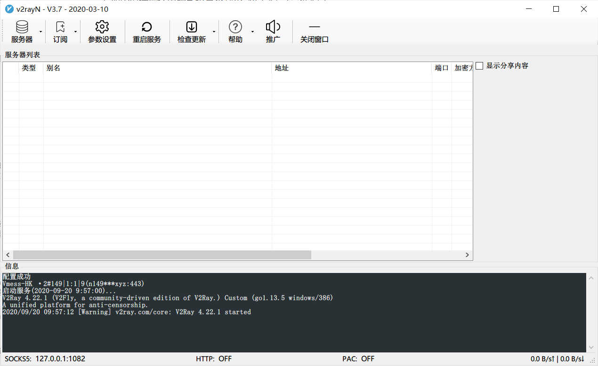
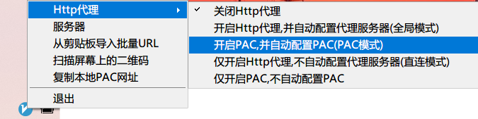

简介
--

v2rayN 是Windows 上对新手比较友好的代理工具。推荐32 位版本的Windows 使用。

下载及安装
-----
[点击下载](https://github.com/2dust/v2rayN/releases)

1.  下载完成后，进行解压，双击文件夹内的v2rayN即可运行。
2.  如闪退请确认电脑系统是否缺少. NET 4.5（最低4.5）。
3.  安装成功后会自动运行v2rayN ，屏幕底部任务栏将显示浅蓝底色的v2rayN 图标。
    *   如果您看不到v2rayN图标，它可能已隐藏，点击可显示隐藏的图标。
    *   双击任务栏v2rayN 图标可显示软件主界面。

#### 允许访问

为了确保v2rayN 正常运行，在安装和运行过程中有任何警告窗口都不要阻止。

设置
--

*   **获取订阅地址**  
    1.  购买相关服务套餐后获取配置文件。
    2.  如已购买，前往用户后台，登入后即可进入您的管理产品页面。
    3.  在管理产品页面上，依次点击「Windows」>「v2rayN」>「复制订阅地址」。

*   **导入订阅地址**  
    1.  在屏幕底部任务栏右键双击v2rayN 图标，进入主界面> 点击「订阅」>「订阅设置」>「添加」> 在备注（remarks）填写「自定义名称」> 在地址（url）栏粘贴刚才的「 v2rayN 订阅地址」> 「确定」
    2.  最后点击左上方的「订阅」>「更新订阅」，同步最新的节点信息。

使用
--

*   在屏幕底部任务栏右键点击v2rayN图标>选择「Http代理模式」>「开启PAC ，并自动配置PAC（PAC模式）」（如果弹出防火墙安全警报，请点击「允许访问」）
    
*   返回v2rayN 主界面，右键点击您需要连接的服务器节点> 「设为活动服务器」。
    
*   看到没有错误代码，即可连接到全球互联网！
    

#### 使用小贴士

强烈建议定期更新：在主界面中，点击左上方的「订阅」>「更新订阅」，可同步最新节点。建议每周至少更新一次。